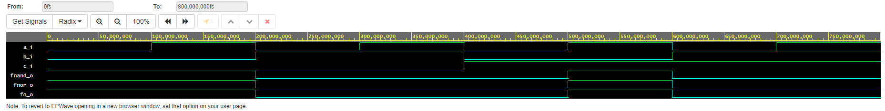
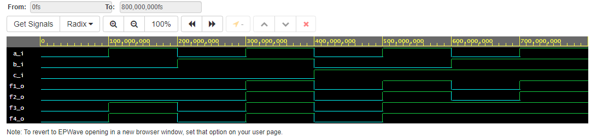

# 1. Submitting the GitHub link
[Link](https://github.com/217196/Digital-electronics-1) to my repository

# 2. Verification of De Morgan's laws of function f(c,b,a)
```vhdl  
     fo_o  <= (a_i and not b_i) or (not b_i and not c_i);
     fnand_o <= not(not((not b_i) and a_i) and not(not c_i and not b_i));
     fnor_o <= not(b_i or not a_i) or not(c_i or b_i);
```
[Link](https://www.edaplayground.com/x/MgMM) to my EDA Playground


screenshot of simulation result 

| **c** | **b** |**a** | **f(c,b,a)** | **f(c,b,a) nand** | **f(c,b,a) nor** |
| :-: | :-: | :-: | :-: | :-: | :-: |
|  0  |  0  |  0  |  1  |  1  |  1  | 
|  0  |  0  |  1  |  1  |  1  |  1  |   
|  0  |  1  |  0  |  0  |  0  |  0  |    
|  0  |  1  |  1  |  0  |  0  |  0  |     
|  1  |  0  |  0  |  0  |  0  |  0  |   
|  1  |  0  |  1  |  1  |  1  |  1  |   
|  1  |  1  |  0  |  0  |  0  |  0  |    
|  1  |  1  |  1  |  0  |  0  |  0  |

# 3. Verification of Distributive laws
[Link](https://www.edaplayground.com/x/Mraf) to my EDA Playground


screenshot of simulation result 
