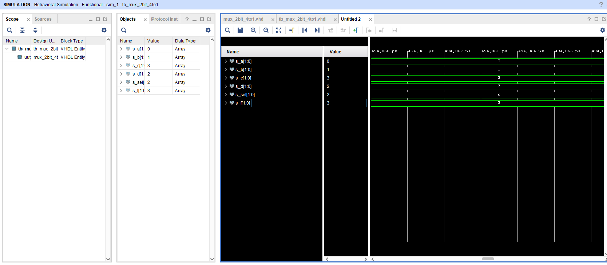
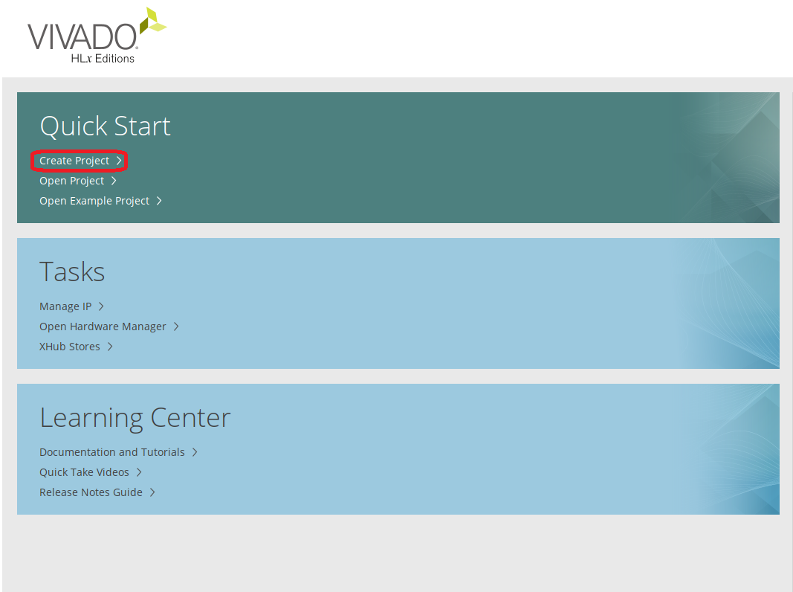
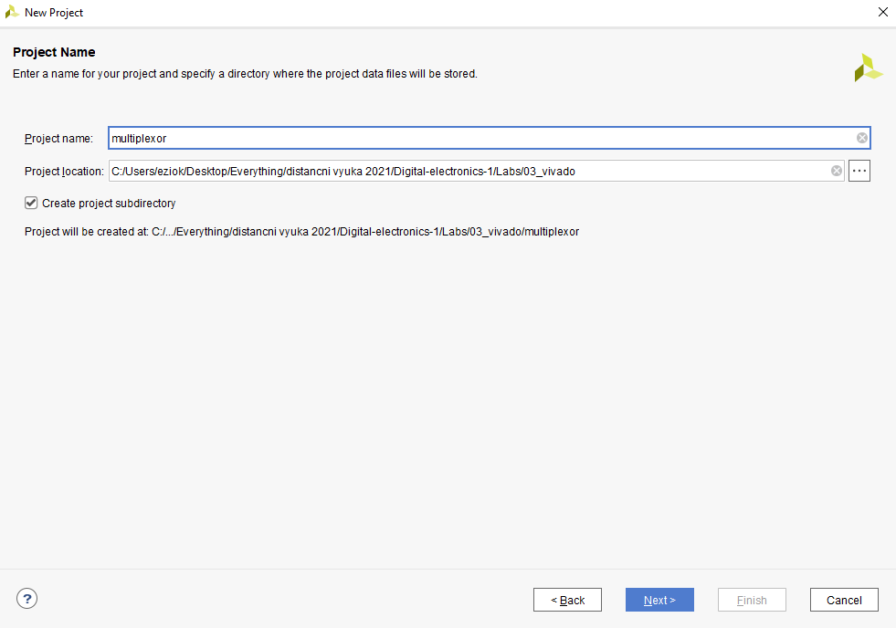
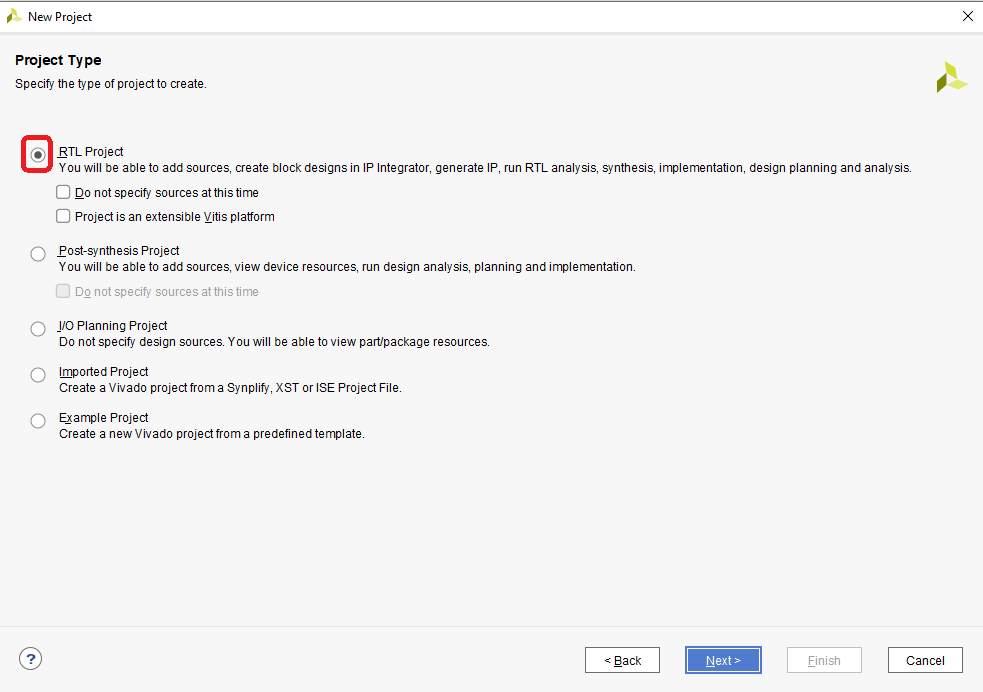
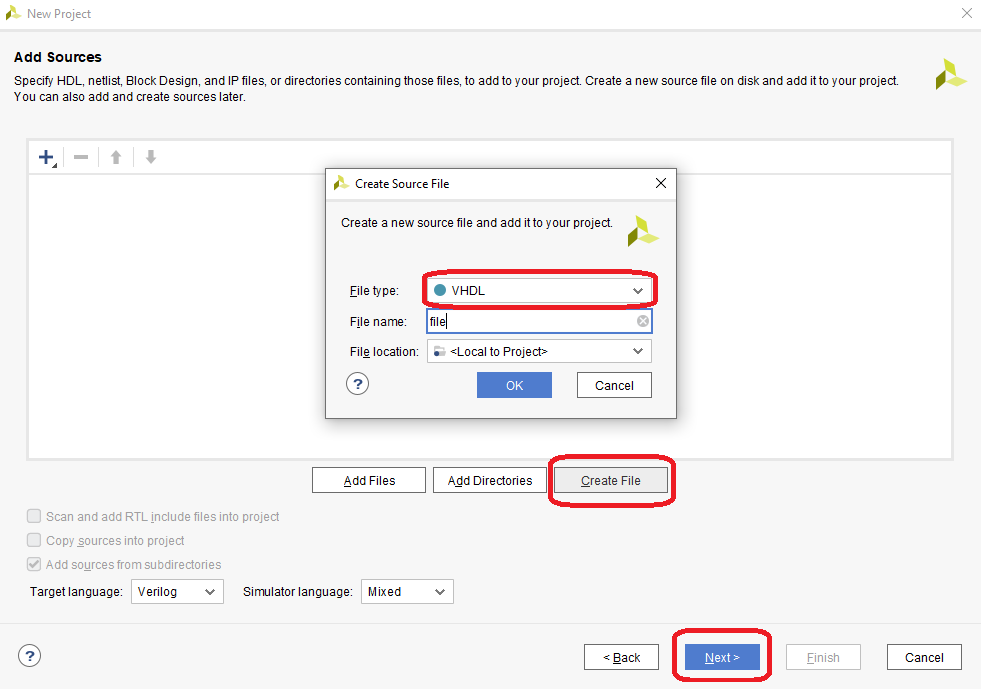
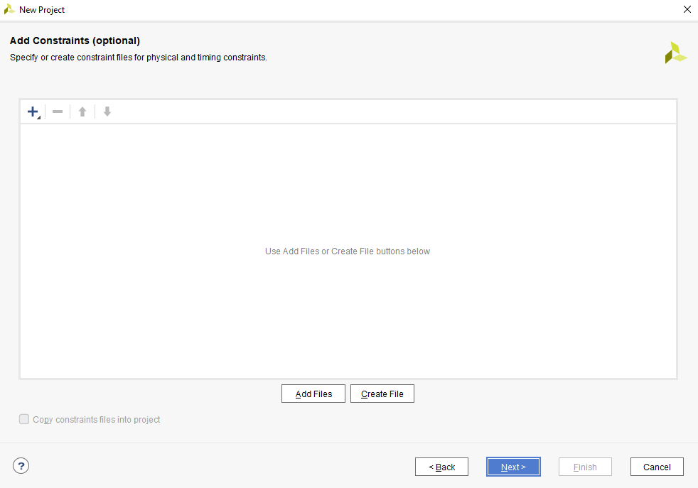
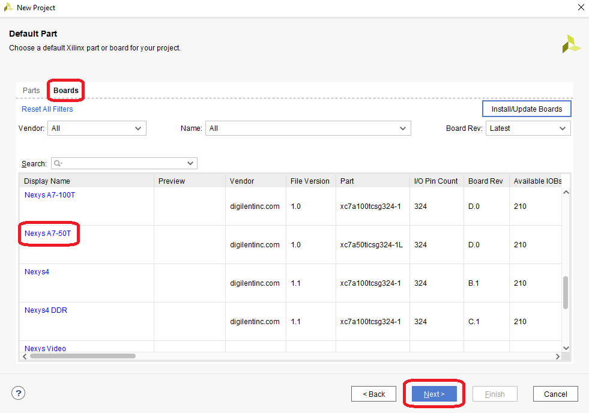
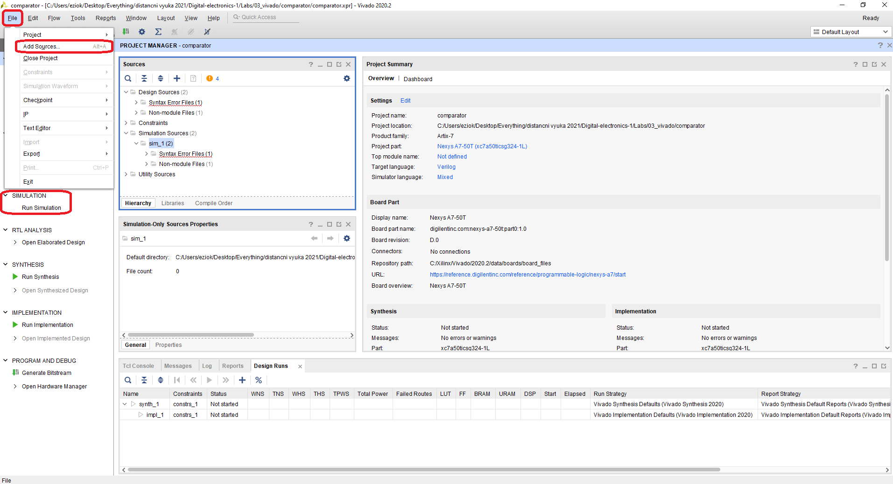
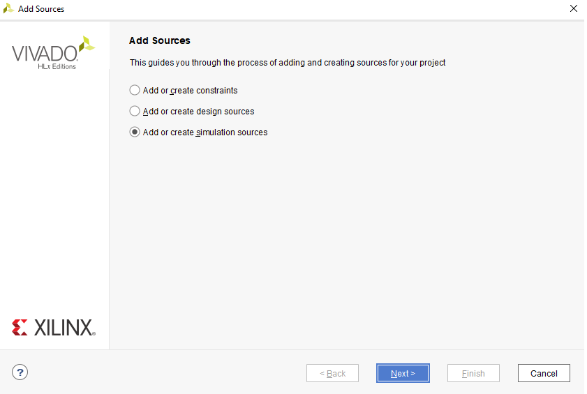

# Vivado

## 1. Figure or table with connection of 16 slide switches and 16 LEDs on Nexys A7 board

| **SW** | **SW pins** | **SW Connection type** |****| **LEDs** | **LED pins** | **SW Connection Type**  |
| :-: | :-: | :-: | :-: | :-: | :-: | :-: |
| 1  | J15 | IOSTANDARD LVCMOS33 | | 1  | H17 |IOSTANDARD LVCMOS33 |
| 2  | L16 | IOSTANDARD LVCMOS33 | | 2  | K15 |IOSTANDARD LVCMOS33 |
| 3  | M13 | IOSTANDARD LVCMOS33 | | 3  | J13 |IOSTANDARD LVCMOS33 |
| 4  | R15 | IOSTANDARD LVCMOS33 | | 4  | N14 |IOSTANDARD LVCMOS33 |
| 5  | R17 | IOSTANDARD LVCMOS33 | | 5  | R18 |IOSTANDARD LVCMOS33 |
| 6  | T18 | IOSTANDARD LVCMOS33 | | 6  | V17 |IOSTANDARD LVCMOS33 |
| 7  | U18 | IOSTANDARD LVCMOS33 | | 7  | U17 |IOSTANDARD LVCMOS33 |
| 8  | R13 | IOSTANDARD LVCMOS33 | | 8  | U16 |IOSTANDARD LVCMOS33 |
| 9  | T8  | IOSTANDARD LVCMOS18 | | 9  | V16 |IOSTANDARD LVCMOS33 |
| 10 | U8  | IOSTANDARD LVCMOS18 | | 10 | T15 |IOSTANDARD LVCMOS33 |
| 11 | R16 | IOSTANDARD LVCMOS33 | | 11 | U14 |IOSTANDARD LVCMOS33 |
| 12 | T13 | IOSTANDARD LVCMOS33 | | 12 | T16 |IOSTANDARD LVCMOS33 |
| 13 | H6  | IOSTANDARD LVCMOS33 | | 13 | V15 |IOSTANDARD LVCMOS33 |
| 14 | U12 | IOSTANDARD LVCMOS33 | | 14 | V14 |IOSTANDARD LVCMOS33 |
| 15 | U11 | IOSTANDARD LVCMOS33 | | 15 | V12 |IOSTANDARD LVCMOS33 |
| 16 | V10 | IOSTANDARD LVCMOS33 | | 16 | V11 |IOSTANDARD LVCMOS33 |


## Two-bit wide 4-to-1 multiplexer
### Listing of VHDL architecture from source file mux_2bit_4to1.vhd with syntax highlighting
```vhdl
architecture Behavioral of mux_2bit_4to1 is
begin

       f_o <= a_i when (sel_i = "00") else
              b_i when (sel_i = "01") else
              c_i when (sel_i = "10") else
              d_i;

end architecture Behavioral;
```
### Listing of VHDL stimulus process from testbench file tb_mux_2bit_4to1.vhd with syntax highlighting and asserts
```vhdl
 p_stimulus : process
    begin
        
        s_d <= "00"; s_c <= "00"; s_b <= "00"; s_a <= "00";
        s_sel <= "00"; wait for 50 ns;
        
        s_d <= "00"; s_c <= "00"; s_b <= "00"; s_a <= "01";
        s_sel <= "00"; wait for 50 ns;
        
        s_d <= "00"; s_c <= "00"; s_b <= "01"; s_a <= "00";
        s_sel <= "00"; wait for 50 ns;
        
        s_d <= "00"; s_c <= "00"; s_b <= "01"; s_a <= "01";
        s_sel <= "00"; wait for 50 ns;
        
        s_d <= "00"; s_c <= "00"; s_b <= "00"; s_a <= "00";
        s_sel <= "00"; wait for 50 ns;
        
        s_d <= "00"; s_c <= "11"; s_b <= "00"; s_a <= "00";
        s_sel <= "00"; wait for 50 ns;
        
        
        report "Stimulus process finished" severity note;

    wait;
    end process p_stimulus;

end architecture testbench;
```
### Screenshot with simulated time waveforms; always display all inputs and outputs


### A Vivado tutorial
Start by opening Vivado and creating a project



Name your project and select desired directory



Select RTL Project



Select "Create a File" and then choose VHDL and name your new project



Skip adding constrants for now



Opt for "Boards" and pick desired board



Add simulation sources and constrants 





And launch the simulation


