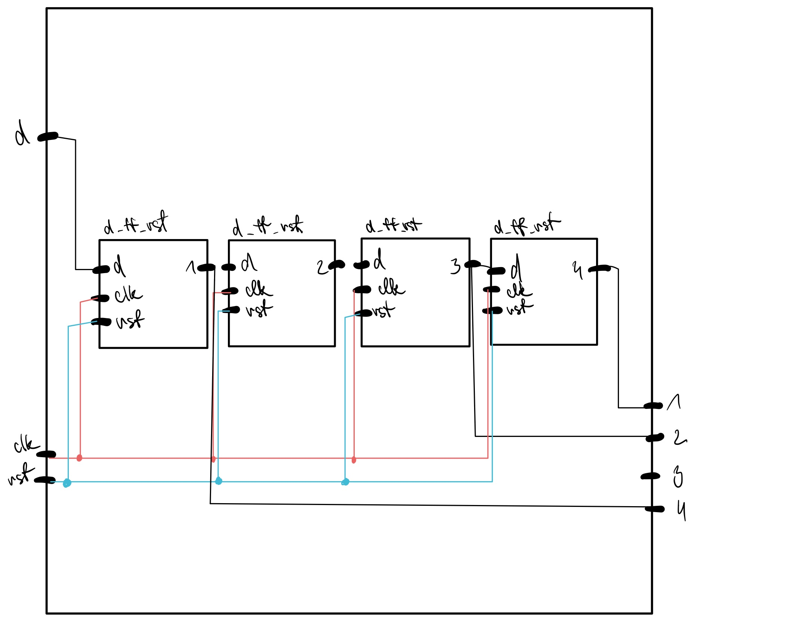

# Flip Flops
| **D** | **Qn** | **Q(n+1)** | **Comments** |
   | :-: | :-: | :-: | :-- |
   | 0 | 0 | 1 | change |
   | 0 | 0 | 1 | no change |
   | 1 | 0 | 1 | change |
   | 1 | 1 | 0 | no change |

   | **J** | **K** | **Qn** | **Q(n+1)** | **Comments** |
   | :-: | :-: | :-: | :-: | :-- |
   | 0 | 0 | 0 | 0 | No change |
   | 0 | 0 | 1 | 1 | No change |
   | 0 | 1 | 0 | 0 | reset |
   | 0 | 1 | 1 | 0 | reset |
   | 1 | 0 | 0 | 1 | set |
   | 1 | 0 | 1 | 1 | set |
   | 1 | 1 | 0 | 1 | toggle |
   | 1 | 1 | 1 | 0 | toggle |

   | **T** | **Qn** | **Q(n+1)** | **Comments** |
   | :-: | :-: | :-: | :-- |
   | 0 | 0 | 0 | no change |
   | 0 | 1 | 1 | no change |
   | 1 | 0 | 1 | invert |
   | 1 | 1 | 0 | invert |
   
   ## D latch
   ### VHDL code listing of the process p_d_latch with syntax highlighting
   ```vhdl
   p_d_latch : process (d, arst, en)                                                        
begin                                                                                    
    if (arst = '1') then                                                                 
        q     <= '0';                                                                    
        q_bar <= '1';                                                                    
    elsif  (en = '1') then                                                               
        q <= d;                                                                          
        q_bar <= not d;                                                                  
    end if;                                                                              
end process p_d_latch;                                                                   
                                                                                         
end Behavioral;
```

### Listing of VHDL reset and stimulus processes from the testbench tb_d_latch.vhd file with syntax highlighting and asserts
```vhdl
p_reset_gen : process
    begin
        s_arst <= '0';
        wait for 38 ns;
        
        -- Reset activated
        s_arst <= '1';
        wait for 53 ns;

        -- Reset deactivated
        s_arst <= '0';
        
        wait for 660 ns; 
        s_arst <= '1';
        
        wait;
    end process p_reset_gen;
    p_stimulus  : process
    begin
    report "Stimulus process started" severity note;
    s_en <= '0';
    s_d  <= '0';

    assert(s_q='0' and s_q_bar = '1')
    report "huh" severity error;

    --d sekvence
    wait for 10 ns;
    s_d <= '1';
    wait for 10 ns;
    s_d <= '0';
    wait for 10 ns;
    s_d <= '1';
    wait for 10 ns;
    s_d <= '0';
    wait for 10 ns;
    s_d <= '1';
    wait for 10 ns;
    s_d <= '0';


    --/d select
    s_en <= '1';

    --d sekvence
     wait for 10 ns;
    s_d <= '1';
    wait for 10 ns;
    s_d <= '0';
    wait for 10 ns;
    s_d <= '1';
    wait for 10 ns;
    s_d <= '0';
    wait for 10 ns;
    s_d <= '1';
    wait for 10 ns;
    s_d <= '0';


 report "Stimulus process finished" severity note;
 end process p_stimulus;
    

    end Behavioral;
```
### Screenshot with simulated time waveforms; always display all inputs and outputs.


## Flip Flops
### VHDL code listing of the processes p_d_ff_arst, p_d_ff_rst, p_jk_ff_rst, p_t_ff_rst with syntax highlighting
```vhdl
p_d_ff_arst : process (clk, arst)             
    begin                                         
        if (arst = '1') then                      
            q     <= '0';                         
            q_bar <= '1';
        elsif  rising_edge(clk) then                    
            q     <= d;                               
            q_bar <= not d;                       
        end if;                                   
    end process p_d_ff_arst;
end Behavioral;
```
---------------------------------------------------------
```vhdl
p_d_ff_rst : process (clk)             
    begin
        if rising_edge(clk) then
            if (rst = '1') then
                q     <= '0';
                q_bar <= '1';
            else
                q     <= d;
                q_bar <= not d;
        end if; 
        end if;
    end process p_d_ff_rst;
end Behavioral;
```
---------------------------------------------------------
```vhdl
p_jk_ff_rst : process (clk)             
    begin                                         
      if rising_edge(clk) then 
          if (rst = '1') then
              s_q <= '0';
              else
                  if (j = '0' and k = '0') then
                  s_q <= s_q;
                  elsif (j = '0' and k = '1') then
                  s_q <= '0';
                  elsif (j = '1' and k = '0') then
                  s_q <= '1';
                  elsif (j = '1' and k = '1') then                   
                  s_q <= not s_q;
                  end if;
                  end if;
                  end if;
                  end process p_jk_ff_rst;
  q     <= s_q;
  q_bar <= not s_q;
  
end Behavioral;
```
---------------------------------------------------------
```vhdl
p_t_ff_rst : process (clk)
    begin
        if rising_edge(clk) then
            if (rst = '1') then
                s_q     <= '0';
                s_q_bar <= '1';
                else
                if (t = '0') then
                s_q     <= s_q;
                s_q_bar <= s_q_bar;
                else
                s_q     <= not s_q;
                s_q_bar <= not s_q_bar;
                end if;
                end if;
                end if;
                end process p_t_ff_rst;
                q     <= s_q;
                q_bar <= s_q_bar;
end Behavioral;
```
### Listing of VHDL clock, reset and stimulus processes from the testbench files with syntax highlighting and asserts
```vhdl
p_reset_gen : process
        begin
            s_arst <= '0';
            wait for 28 ns;
            
            -- Reset activated
            s_arst <= '1';
            wait for 13 ns;
    
            -- Reset deactivated
            s_arst <= '0';
            
            wait for 17 ns;
            s_arst <= '1';
            
            wait for 33 ns;
            s_arst <= '0';
            
            wait for 660 ns;
            s_arst <= '1';
    
            wait;
        end process p_reset_gen;

    p_stimulus : process
    begin
        report "Stimulus process started" severity note;
        s_d <= '0';
        
        --d sekv
        wait for 12 ns;
        s_d  <= '1';
        wait for 10 ns;
        s_d  <= '0';
        
        wait for 8 ns;
        
        wait for 4 ns;
        s_d  <= '1';
        wait for 10 ns;
        s_d  <= '0';
        wait for 10 ns;
        s_d  <= '1';
        wait for 10 ns;
        s_d  <= '0';   
        --/d sekv
        
        --d sekv
        wait for 10 ns;
        s_d  <= '1';
        wait for 10 ns;
        s_d  <= '0';
        wait for 10 ns;
        s_d  <= '1';
        wait for 10 ns;
        s_d  <= '0';
        wait for 10 ns;
        s_d  <= '1';
        wait for 10 ns;
        s_d  <= '0';   
        --/d sekv
        
    report "Stimulus process finished" severity note;
    wait;
    end process p_stimulus;
end Behavioral;
```
---------------------------------------------------------
```vhdl
p_reset_gen : process
        begin
            s_rst <= '0';
            wait for 10 ns;
            
            s_rst <= '1';
            wait for 10 ns;
            
            s_rst <= '0';
            wait;
        end process p_reset_gen;
        
    p_stimulus : process
    begin
        report "Stimulus process started" severity note;

        wait for 20 ns;
        s_t <= '1';  
        wait for 10 ns;
        s_t <= '0';                       
        wait for 10 ns;
        s_t <= '1';        
        wait for 10 ns;
        s_t <= '0';       
        wait for 10 ns;
        s_t <= '1';
        wait for 10 ns;
        s_t <= '0';

        assert(s_q='1' and s_q_bar = '0')
        report "nope" severity error;
        
        report "Stimulus process finished" severity note;
        wait;
        end process p_stimulus;       
end Behavioral;
```
---------------------------------------------------------
```vhdl
 p_reset_gen : process
        begin
            s_rst <= '0';
            wait for 28 ns;
            
            s_rst <= '1';
            wait for 13 ns;
            
            s_rst <= '0';
            
            wait for 17 ns;
            s_rst <= '1';
            
            wait for 33 ns;
            s_rst <= '0';
            
            wait for 660 ns;
            s_rst <= '1';
    
            wait;
        end process p_reset_gen;

    p_stimulus : process
    begin
        report "Stimulus process started" severity note;
        s_j <= '0';
        s_k <= '0';
        
        --d sekv
        wait for 30 ns;
        s_j <= '0';
        s_k <= '0';        
        wait for 3 ns;
        s_j <= '1';
        s_k <= '0';                       
        wait for 5 ns;
        s_j <= '0';
        s_k <= '1';        
        wait for 10 ns;
        s_j <= '1';
        s_k <= '0';       
        wait for 10 ns;
        s_j <= '1';
        s_k <= '1';
        --/d sekv
        
        --d sekv
        wait for 10 ns;
        s_j <= '0';
        s_k <= '0';             
        wait for 10 ns;
        s_j <= '0';
        s_k <= '1';     
        wait for 10 ns;
        s_j <= '1';
        s_k <= '0';     
        wait for 10 ns;
        s_j <= '1';
        s_k <= '1';
        
        report "Stimulus process finished" severity note;
        wait;
    end process p_stimulus;
    
end Behavioral;
```
---------------------------------------------------------
```vhdl
p_reset_gen : process
        begin
            s_rst <= '0';
            wait for 10 ns;
            
            s_rst <= '1';
            wait for 10 ns;
            
            s_rst <= '0';
            wait;
        end process p_reset_gen;
        
    p_stimulus : process
    begin
        report "Stimulus process started" severity note;

        wait for 20 ns;
        s_t <= '1';  
        wait for 10 ns;
        s_t <= '0';                       
        wait for 10 ns;
        s_t <= '1';        
        wait for 10 ns;
        s_t <= '0';       
        wait for 10 ns;
        s_t <= '1';
        wait for 10 ns;
        s_t <= '0';

        assert(s_q='1' and s_q_bar = '0')
        report "nope" severity error;
        
        report "Stimulus process finished" severity note;
        wait;
        end process p_stimulus;       
end Behavioral;
```
### Screenshot with simulated time waveforms; always display all inputs and outputs


## Shift register
### Image of the shift register schematic

